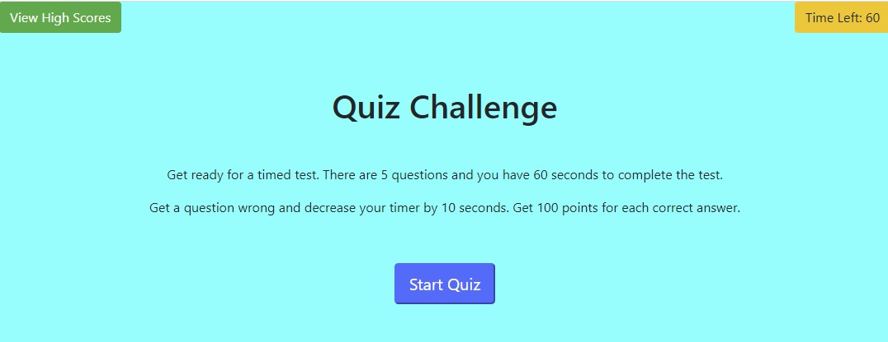

# timed-quiz-utilizing-DOM-JS

## Description
For this project I created an timed quiz application.
The index.html page was created from scratch and had 4 different sections: 
    <ol>
        <li>The first section was the start screen for the quiz. Once you clicked on the start quiz button it would take you to the quiz section.</li>
        <li>The second section was the quiz section with the questions. The quiz consisted of 5 questions and you had 60 seconds to answer them. If you got a question wrong your time was decremented by 5 seconds. If you got a question right your score increased by 100 points.</li>
        <li>The third section was the end of quiz screen which showed your final score. Here you would entered you initials so that you could be added to the high score page.</li>
        <li>The fourth section was the high score section which show the high score. Here you could clear the high score from the local storage.</li>
    </ol>
    
This was accomplished by: 
    <ul>
        <li>Using JavaScript to manipulate the DOM of the index.HTML. The JavaScript has variables using document.QuerySelector for ids.</li>
        <li>Using addEventListeners for the start button, the submit initials button, the view high score button, the clear high scores button.</li>
        <li>Using functions to:</li>
        <li>To start the quiz.</li>
        <li>To generate the questions and answer choices.</li>
        <li>To check the users answer to the answer key.</li>
        <li>To end the quiz.</li>
        <li>To add initials to high score list.</li>
        <li>To retrieve high scores from local storage.</li>
        <li>To render high scores to high score list after retrieving them from local storage.</li>
        <li>To store high scores to local storage.</li>
        <li>To clear high scores from local storage.</li>
    </ul>

## Technologies Used
<ul>
    <li>HTML</li>
    <li>CSS</li>
    <li>JavaScript</li>
    <li>DOM Manipulation</li>
    <li>Functions</li>
    <li>Local Storage</li>
</ul>

## What I Learned

While working on this project I learned how to use various JavaScript elements such as: arrays, functions, and for Loops. The biggest learning moment was learning how to use the DOM to manipulate the html. That was no easy feat. 

## Link to timed quiz website:
https://cdrobinsoniii.github.io/timed-quiz-utilizing-DOM-JS/